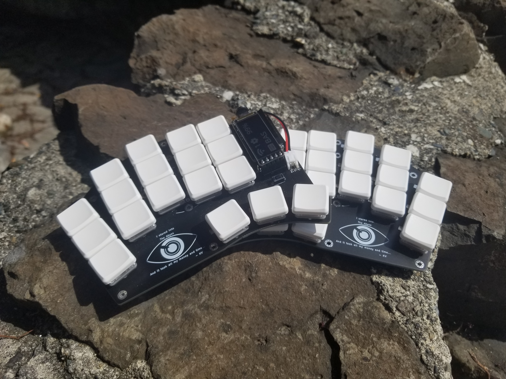

# The Abyss
A low-profile diode-less 36-key keyboard with nice!view support. Designed with Ergogen and Kicad. Meant to be used with [ZMK](https://zmk.dev/).

Named after where too much of my time and money went, *The Abyss*.

A keymap can be found [here](https://github.com/kvietcong/zmk-config/blob/master/config/the_abyss.keymap) and the shield can be found in [my ZMK config](https://github.com/kvietcong/zmk-config).

## Pictures

## Info
> The following is just a long-winded description and commentary of how I designed the board, ordered parts, and assembled it.

TODO

## "Review"
> The following is just me rambling about the keyboard and ways I'd might change it in another design.

TODO

## Things to do
- Finish up this README.
- Design a carrying case for it.
    - Maybe design a bottom case for it.
- Make a video about it.

